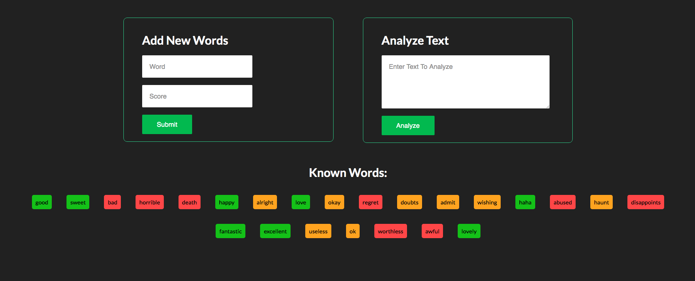

    

        
         
        <b>Simple Sentiment Analysis Practice Project</b>
    

---

Just trying out Node.js and Express framework for the first time, this is supposed to
be a simple "Lookup Table" sorta Sentiment Analysis project consisting of an `Express server`
backend dealing with JSON files and a `vanila HTML/CSS/JS` frontend client to provide an
interface to the backend api.

---

# Try It Out
* Clone this repo using `git clone`
* Run `npm install`
* Run `node server.js`
* Open browser and Navigate to `http://localhost:3000/`

# Concepts Implemented
* Setting up Development Environment (Nodemon & browser-sync)
* Simple Node.js Server using Express
* REST Api basics, along with GET & POST request implemention
* JSON file Handling (Async/Sync) in node.js
* Modularization in node.js
* API testing using FrontEnd Client **(Main Motivation)**
* Frontend Design using CSS and JS
* Bare Simple UX Design
